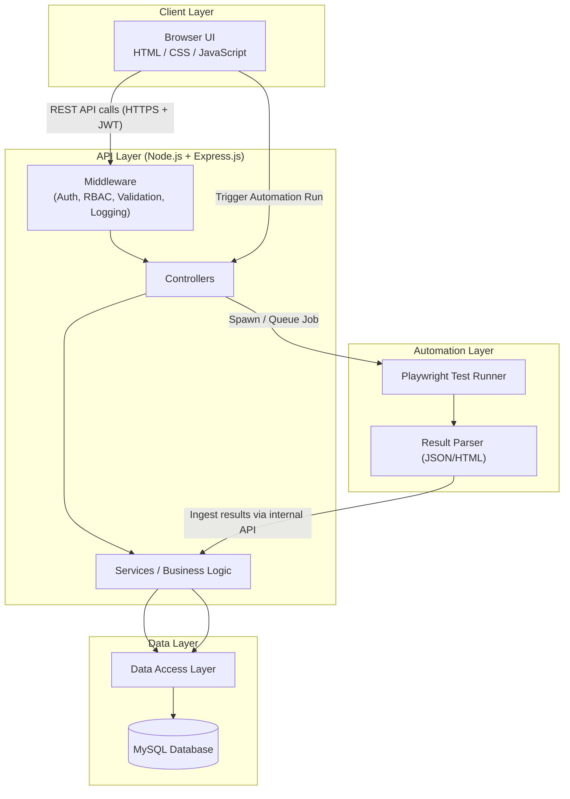
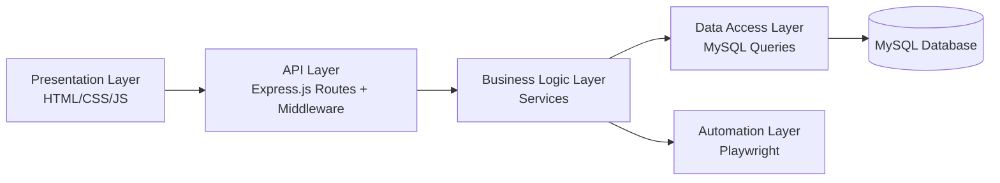
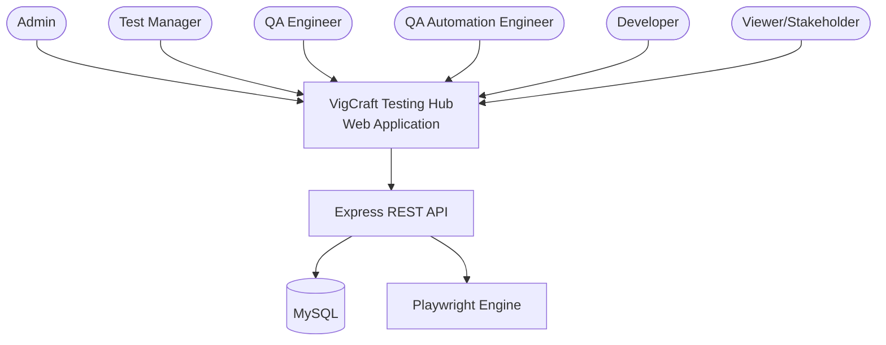

# 2. High-Level Architecture Diagram (Mermaid)

## 2.1 System Overview Diagram

## 2.2 Layered View

## 2.3 Actor-Level Context Diagram

## 2.4 Notes
- All arrows crossing the Client → API boundary represent HTTPS calls secured with JWT Bearer tokens.
- The Playwright Runner is invoked asynchronously; results are ingested back into MySQL through the
  same REST API surface used by the UI (no direct DB access from the automation layer).
