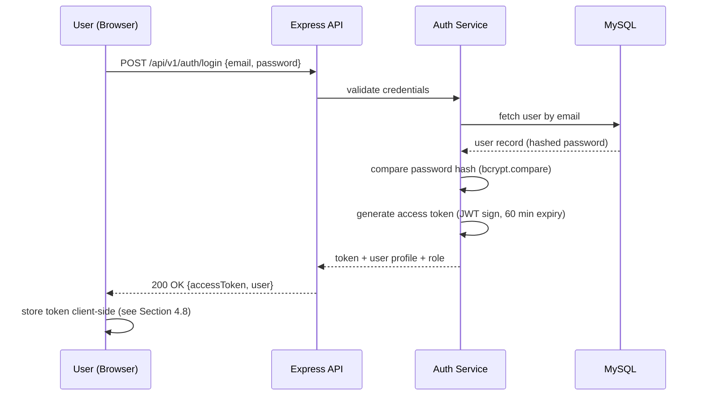
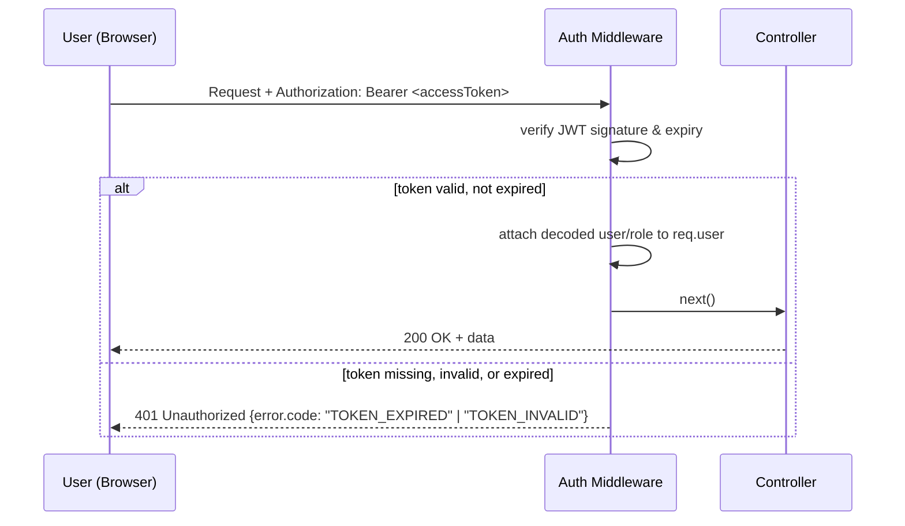

# 8. Authentication Flow (JWT)

## 8.1 Overview
VigCraft Testing Hub uses **stateless JWT-based authentication**. No server-side session store is
required, which keeps the API layer stateless and horizontally scalable.

## 8.2 Token Strategy (MVP)
- **Access Token only** for MVP: a single signed JWT is issued at login and sent in the
  `Authorization: Bearer <token>` header on every protected request.
- **Expiration**: the access token is issued with a **fixed 60-minute expiry** (`exp` claim),
  balancing session convenience against the risk of a long-lived stolen token.
- Tokens are signed with a server-side secret (`JWT_SECRET`) — see Section 17 for environment
  management.
- Refresh tokens are explicitly **not** part of MVP — see Section 8.5 (Future Scope).

## 8.3 Login Sequence



## 8.4 Authenticated Request & Expiration Handling


- The middleware distinguishes an **expired** token from an **invalid** token in the error code
  (`TOKEN_EXPIRED` vs `TOKEN_INVALID`) so the frontend can show an accurate "your session has
  expired" message rather than a generic auth error.
- On any `401`, the frontend's `apiClient` (Section 4.6) discards the stored token and redirects the
  user to `login.html`. For MVP, expiration is handled by **requiring re-login** — there is no
  silent token renewal.

## 8.5 Refresh Token — Future Scope
A refresh-token flow (longer-lived token, `httpOnly` cookie storage, silent access-token renewal via
`POST /auth/refresh`) is **explicitly deferred beyond MVP**. It is listed as a Future Scope
enhancement (Section 23) once session-length feedback from real usage justifies the added complexity
and the httpOnly-cookie storage/CSRF-handling work it requires.

## 8.6 Password Security
- Passwords are stored using **bcrypt** hashing (salted, adaptive cost factor) — never in plaintext
  and never with reversible encryption.
- Password comparison at login uses `bcrypt.compare()` against the stored hash; the plaintext
  password is never logged or persisted anywhere (see Section 14.7).
- Minimum password complexity is enforced at the validation layer (`validators/`) before a password
  is ever hashed and stored.

## 8.7 Logout
- Logout is handled client-side by discarding the stored token; because MVP uses a single
  short-lived access token with no refresh token, there is no server-side token to revoke.

## 8.8 JWT Payload (Logical Shape)
```json
{
  "sub": "user_id",
  "email": "user@example.com",
  "role": "qa_engineer",
  "iat": 1710000000,
  "exp": 1710003600
}
```
`exp - iat` is fixed at 3600 seconds (60 minutes) for MVP, per Section 8.2.
