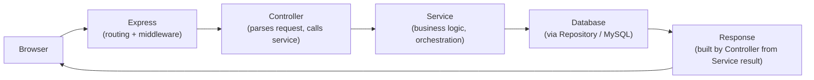
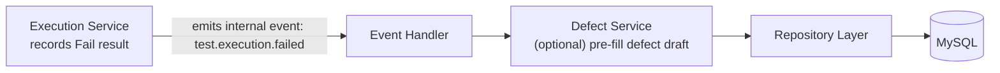
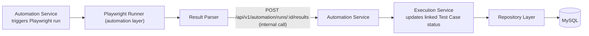

# 10. Module Communication Flow

## 10.1 Overview
This document describes how functional modules within the backend communicate with each other,
ensuring loose coupling and single-responsibility boundaries.

## 10.2 Communication Rules
- Modules communicate **only through service-layer function calls** within the same process for
  MVP (modular monolith) — never through direct repository/database access across modules, and
  never by one module's controller calling another module's controller or repository directly.
- Cross-module orchestration (e.g., Execution module needing Defect module on failure) happens at
  the **Service layer**, coordinated by an orchestrating service or a lightweight internal event
  mechanism.
- This "services-only" rule is what keeps the modular monolith modular: any module's internals
  (its controller, repository, and models) remain private to that module, and its service layer is
  the only public surface other modules are allowed to depend on.

## 10.3 Complete Request Flow (Single Module)
Every request into the system — regardless of which module it targets — follows the same end-to-end
path through the layered architecture (see Section 5):

- **Browser → Express**: the HTTP request arrives and passes through global middleware (auth,
  logging, validation) before reaching a route.
- **Express → Controller**: the matched route hands off to its Controller, which is the only layer
  allowed to read the raw request and write the raw response.
- **Controller → Service**: the Controller calls exactly one Service method, passing already-parsed
  input; the Controller contains no business logic itself.
- **Service → Database**: the Service applies business rules and calls its module's Repository,
  which is the only layer that talks to MySQL.
- **Database → Response → Browser**: the Repository result flows back up through the Service to the
  Controller, which shapes the standard response envelope (Section 7.4 / 13.5) and returns it to the
  Browser.

## 10.4 Example Flow: Manual Test Execution → Defect Creation

## 10.5 Example Flow: Playwright Automation → Result Ingestion

## 10.6 Internal Event Mechanism (Lightweight)
For MVP, an in-process **Node.js EventEmitter** is used for decoupled internal notifications (e.g.,
`test.execution.failed`, `automation.run.completed`) rather than a message broker, keeping
operational overhead low while preserving decoupled module design. This is a deliberate seam for a
future migration to a message queue (e.g., RabbitMQ/Kafka) if the system evolves to microservices.

## 10.7 Synchronous vs Asynchronous Boundaries
| Interaction | Type | Rationale |
|---|---|---|
| UI → API (CRUD) | Synchronous REST | Immediate user feedback required |
| Trigger Playwright Run | Synchronous trigger, Asynchronous execution | Run may take minutes; UI polls/receives run status |
| Result Ingestion → Execution Update | Synchronous (internal call) | Must be consistent before reporting reflects it |
| Notification dispatch | Asynchronous (fire-and-forget) | Non-blocking for core flows |
