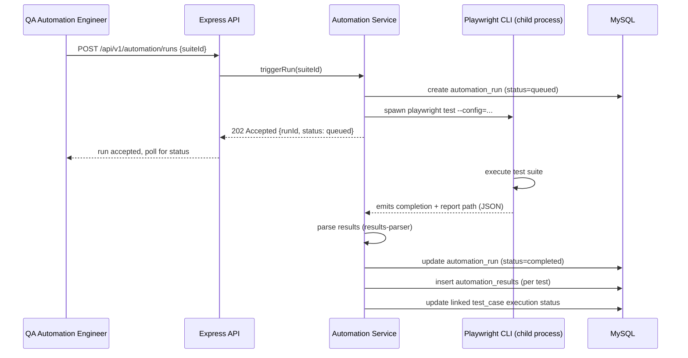

# 11. Playwright Integration Architecture

## 11.1 Overview
Playwright is integrated as the automated test execution engine, orchestrated by the backend and
reporting results back into the same MySQL system of record used for manual testing — giving a
unified view of quality across manual and automated coverage.

## 11.2 Integration Approach
- Playwright test scripts live in the dedicated top-level `playwright/` folder of the repository
  (Section 3.1), decoupled from the core API codebase in `backend/`.
- The backend **does not execute arbitrary test code from the UI**; it triggers **predefined,
  version-controlled Playwright suites** identified by a suite/run configuration, preventing
  arbitrary code execution risk.
- Execution runs as a **child process / job** invoked by the Automation Service, with the working
  directory scoped to the automation suite.

## 11.3 Trigger Flow

## 11.4 Result Ingestion
- Playwright is configured to emit a **JSON reporter** output in addition to the HTML report.
- The `results-parser` module reads the JSON report and maps each spec/test result to:
  - `automation_runs` (run-level metadata: status, duration, triggeredBy, timestamps)
  - `automation_results` (per-test-case result: pass/fail/skipped, duration, error message, trace/
    screenshot reference path)
- HTML report artifacts are stored on disk (or object storage in later phases) and linked via a
  reference path in `automation_results` for on-demand viewing.

## 11.5 Mapping Automated Tests to Test Cases
- Each Playwright spec is tagged/annotated with a `testCaseId` (or a naming convention mapped via a
  suite manifest) so results can be correlated to the corresponding entry in `test_cases`,
  unifying manual and automated execution history for that test case.

## 11.6 Isolation & Safety
- Automation runs execute in a sandboxed working directory with restricted file system/network
  access appropriate to the environment.
- Run concurrency is controlled by a queue (simple in-process queue for MVP) to avoid resource
  exhaustion; concurrency limits are configurable per environment.

## 11.7 Failure Handling
- If the Playwright process crashes or times out, the Automation Service marks the `automation_run`
  as `failed` with an error summary, ensuring no run is left indefinitely in `running` state
  (timeout watchdog).
