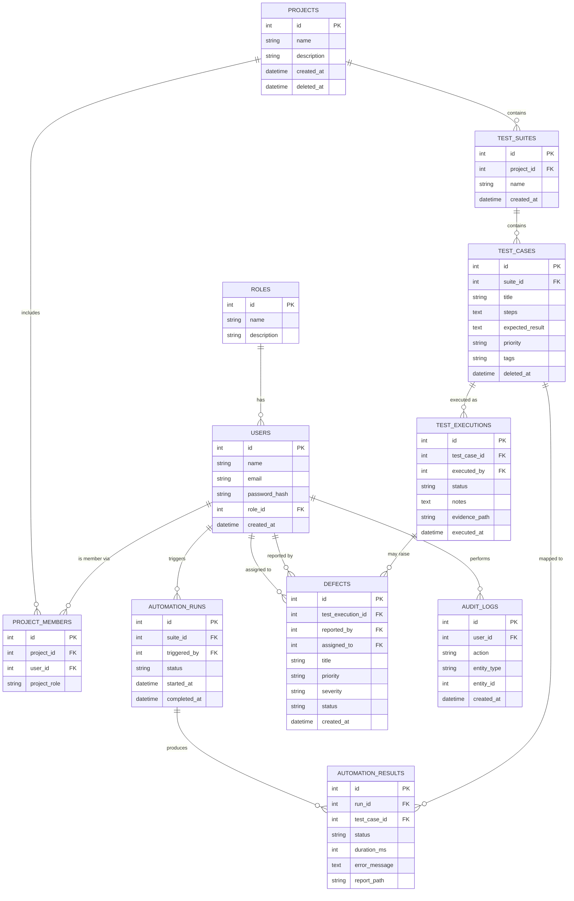

# 12. Database Relationships (ERD)

## 12.1 Entity Relationship Diagram

## 12.2 Relationship Notes
- `PROJECTS 1—N TEST_SUITES 1—N TEST_CASES`: strict hierarchical ownership; deleting a project
  cascades soft-deletes down (never hard-delete cascades, to preserve execution history).
- `TEST_CASES 1—N TEST_EXECUTIONS`: full execution history retained per test case (no overwrite).
- `AUTOMATION_RUNS 1—N AUTOMATION_RESULTS`: one run may cover many test cases (a suite run).
- `TEST_EXECUTIONS 1—N DEFECTS`: a failed execution may result in zero or more linked defects.
- `USERS 1—N PROJECT_MEMBERS N—1 PROJECTS`: many-to-many between Users and Projects via the join
  table, carrying a project-scoped role/assignment.

## 12.3 Referential Integrity Rules
| Relationship | On Parent Delete |
|---|---|
| Project → Test Suite | RESTRICT (must archive/soft-delete suites first) |
| Test Suite → Test Case | RESTRICT |
| Test Case → Test Execution | RESTRICT (history preserved) |
| Test Execution → Defect | SET NULL (defect retained even if execution record is archived) |
| Automation Run → Automation Result | CASCADE (results meaningless without run) |
