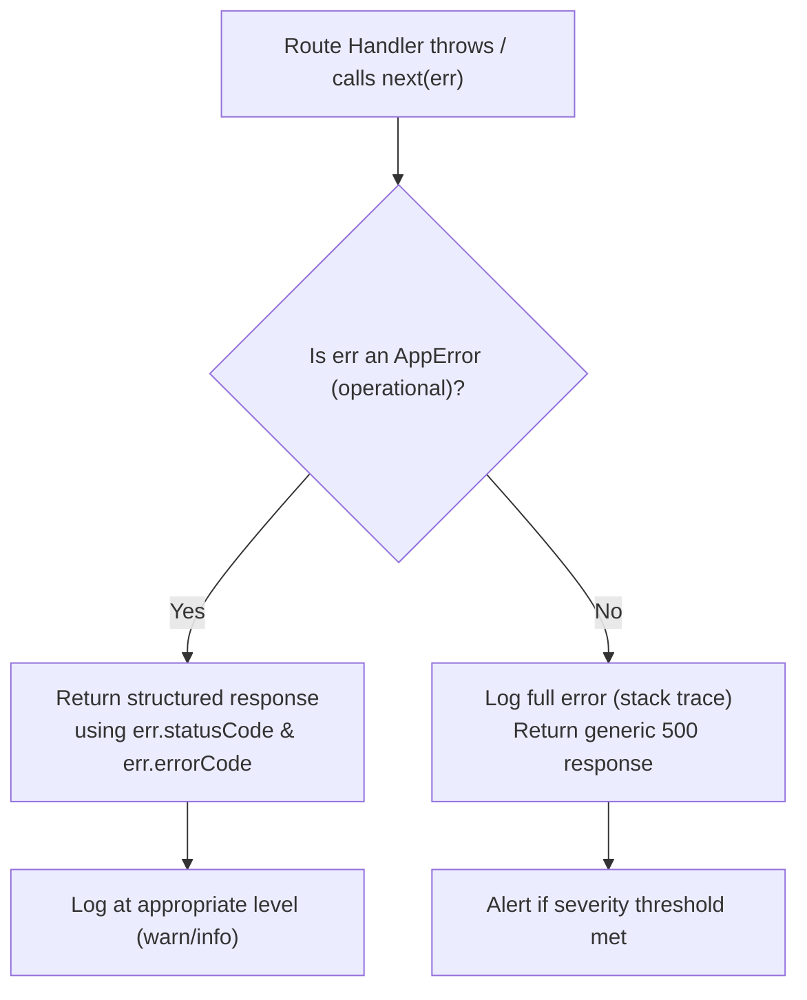

# 13. Error Handling Strategy

## 13.1 Principles
- Fail fast, fail clearly: every error surfaced to the client is structured, actionable, and never
  leaks internal implementation details (stack traces, SQL errors) in production.
- All errors funnel through a **single centralized Express error-handling middleware**.

## 13.2 Standard API Error Response Structure
Every error response returned by the API — regardless of category — uses the same envelope:
```json
{
  "success": false,
  "error": {
    "code": "TESTCASE_NOT_FOUND",
    "message": "Test case with id 452 was not found.",
    "details": []
  }
}
```
- `code` — a stable, machine-readable error code (`UPPER_SNAKE_CASE`) the frontend can switch on.
- `message` — a human-readable, safe-to-display message (never a raw stack trace or SQL error).
- `details` — optional array of field-level validation issues (empty when not applicable).

## 13.3 Error Category → HTTP Status Code Mapping
| Category | Example | HTTP Status |
|---|---|---|
| Validation Error | Missing required field | 400 |
| Authentication Error | Missing/invalid/expired JWT | 401 |
| Authorization Error | Insufficient role/permission | 403 |
| Not Found Error | Resource ID doesn't exist | 404 |
| Conflict Error | Duplicate unique field | 409 |
| Business Rule Violation | Invalid state transition | 422 |
| Automation Error | Playwright run failure/timeout | 424 / 500 |
| Unexpected/Server Error | Unhandled exception, DB connection failure | 500 |

Every error thrown anywhere in the application maps to exactly one row above, so the HTTP status
code and the `error.code` returned to the client are always consistent with each other and with
this table.

## 13.4 Custom Error Classes
A base `AppError` class (with `statusCode`, `errorCode`, `message`, `isOperational`) is extended by
specific error types (`ValidationError`, `NotFoundError`, `AuthError`, `ForbiddenError`,
`ConflictError`). Services throw these typed errors; controllers never construct raw HTTP responses
for error cases. Each typed error carries the `statusCode`/`errorCode` pair defined in the mapping
table above (Section 13.3), so the mapping is enforced in code, not just documentation.

## 13.5 Centralized Error Middleware Flow

This is the single funnel referenced in Section 13.1 — every error, from every module, resolves to
the same response envelope (Section 13.2) via this one middleware.

## 13.6 Frontend Error Handling
- The frontend `apiClient` intercepts all non-2xx responses, maps `error.code` to user-friendly
  messaging, and displays consistent UI error states (inline field errors for 400/422, toast/banner
  for 403/404/500, redirect-to-login for 401).

## 13.7 Automation-Specific Error Handling
- Playwright process crashes, timeouts, or malformed report output are caught explicitly in the
  Automation Service and surfaced as `AUTOMATION_RUN_FAILED` rather than propagating raw
  child-process errors.

## 13.8 Unhandled Rejection / Exception Safety Net
- Process-level `unhandledRejection` and `uncaughtException` handlers log the incident and trigger a
  controlled shutdown/restart (via process manager) rather than leaving the process in an
  inconsistent state.
