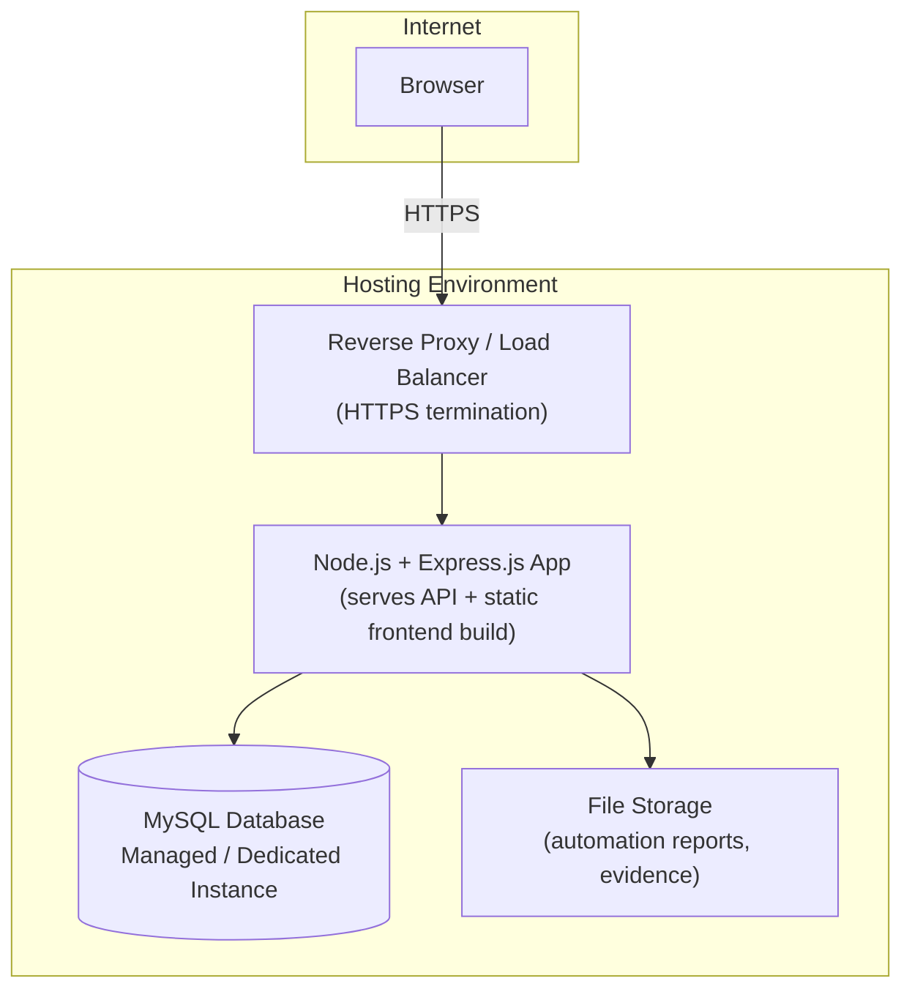

# 16. Deployment Architecture

## 16.1 Overview
MVP deployment targets a straightforward single-application deployment model, with a clear path to
containerization and horizontal scaling in later phases.

## 16.2 Deployment Diagram (MVP)

## 16.3 Environments
| Environment | Purpose |
|---|---|
| Local (Dev) | Developer machines, local MySQL, `.env.development` |
| Staging/QA | Sprint demo, QA/automation validation, mirrors production config |
| Production | Live system post-UAT sign-off (Sprint 7) |

## 16.4 Deployment Model (MVP)
- Single Node.js process (Express) serves the REST API and the static frontend pages (`frontend/`)
  directly — no framework build step — behind a reverse proxy (e.g., Nginx) handling HTTPS
  termination and basic caching of static assets.
- MySQL runs as a dedicated managed instance (not co-located with the app process) to allow
  independent scaling/backups.
- Automation report artifacts (Playwright HTML reports) are written to `backend/uploads/` (Section
  3.4), referenced by URL from `automation_results`.
- **No containerization for MVP** — the app is deployed as a plain Node.js process. Docker/Docker
  Compose is intentionally deferred; see Section 16.8.

## 16.4.1 Environment-Based Configuration
- All environment-specific values (DB credentials, `JWT_SECRET`, base URLs, log level) are supplied
  through environment variables, never hard-coded — see Section 17 for the full variable list.
- Each environment (Local, Staging, Production — Section 16.3) loads its own `.env` file
  (`.env.development`, `.env.staging`, `.env.production`), all following the same shape defined in
  `.env.example`, so promoting a build between environments never requires a code change — only a
  configuration change.

## 16.5 Process Management
- The Node.js process is managed by a process supervisor (e.g., PM2 or systemd) to ensure automatic
  restart on crash and log capture.

## 16.6 Release Process Alignment
- Deployment aligns with the branching strategy defined in Sprint Planning: `release/*` branches are
  deployed to Staging for UAT; `main` is deployed to Production only after UAT sign-off.

## 16.7 Rollback Strategy
- Each deployment is tagged/versioned; rollback is performed by redeploying the previous known-good
  tagged build and, if needed, reverting the most recent backward-incompatible migration.

## 16.8 Docker — Future Scope
- **Docker is explicitly out of MVP scope.** A `docker-compose.yml` placeholder exists in the
  repository structure (Section 3.1) but is not used for MVP deployment; it marks the intended
  future containerized deployment path (App + MySQL + reverse proxy) once the team needs
  reproducible multi-environment orchestration beyond the simple process-based MVP model — see
  Section 23 (Roadmap).
