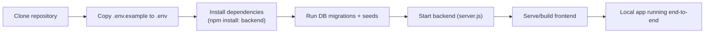
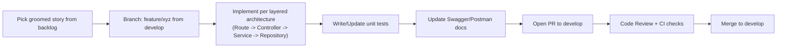

# 20. Development Workflow

## 20.1 Branching Strategy (recap from Sprint Planning)
`main` → `develop` → `feature/*`, with `release/*` and `hotfix/*` as needed (see Sprint Planning
document, Section 13, for full branch definitions and merge rules).

### 20.1.1 Branch Naming Examples
| Branch Type | Pattern | Example |
|---|---|---|
| Feature | `feature/<ticket>-<short-description>` | `feature/VCT-104-test-case-editor` |
| Bug fix (pre-release) | `bugfix/<ticket>-<short-description>` | `bugfix/VCT-118-defect-status-not-saving` |
| Release | `release/<version>` | `release/1.2.0` |
| Hotfix (production) | `hotfix/<ticket>-<short-description>` | `hotfix/VCT-201-login-500-error` |

Branch names are always lowercase, hyphen-separated, and include the tracking ticket ID so every
branch is traceable back to a backlog item.

## 20.2 Local Development Setup Flow

## 20.3 Feature Development Workflow

## 20.4 QA Workflow Alignment
- Once a feature merges to `develop`, QA performs functional, API, and regression testing against
  the integrated `develop` build (per Sprint Planning Testing Strategy).
- Defects found are logged directly in VigCraft Testing Hub itself (dogfooding), linked to the
  originating story/module.

## 20.5 Sprint-Level Workflow
- Aligns directly with the Sprint Planning document's Sprint 0–7 breakdown and Entry/Exit Criteria:
  each sprint's feature branches merge into `develop`, culminating in a `release/*` branch cut for
  Staging validation and Sprint Demo.

## 20.6 Pull Request Workflow
1. Push the `feature/*` branch and open a PR targeting `develop` (or `main` for a `hotfix/*` branch).
2. PR title follows `[<ticket>] <short description>` (e.g., `[VCT-104] Add test case editor page`).
3. PR description includes: what changed, why, how it was tested, and links to the ticket.
4. CI checks (Section 20.7 — lint, unit tests, build) must pass before review is requested.
5. At least **one approving review** is required before merge; the reviewer works through the
   checklist in Section 20.6.1.
6. Author addresses review comments as new commits (no force-push during active review) and
   re-requests review.
7. Once approved and CI is green, the author (or reviewer, per team convention) merges using
   **squash merge**, producing one clean commit per PR on `develop`.
8. The source branch is deleted immediately after merge.

## 20.6.1 Code Review Checklist (minimum)
- Follows layered architecture boundaries (no logic leakage between layers)
- Adequate test coverage for new/changed logic
- No secrets/credentials committed
- API changes reflected in Swagger/Postman
- No direct SQL string concatenation
- Error handling follows Section 13 conventions
- No sensitive data written to logs (Section 14.7)

## 20.7 Continuous Integration (Baseline for MVP)
- On every PR: install dependencies, run lint, run unit tests, run build — blocking merge on
  failure (aligns with the "Build Successful" and "Code Reviewed" Definition of Done items).
