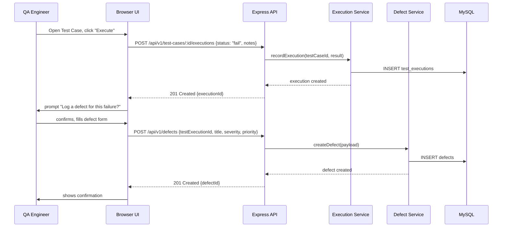
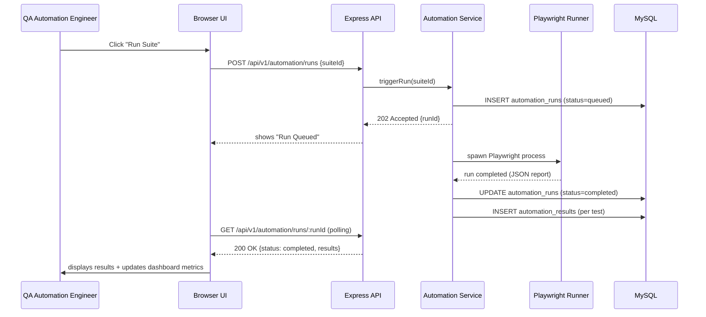
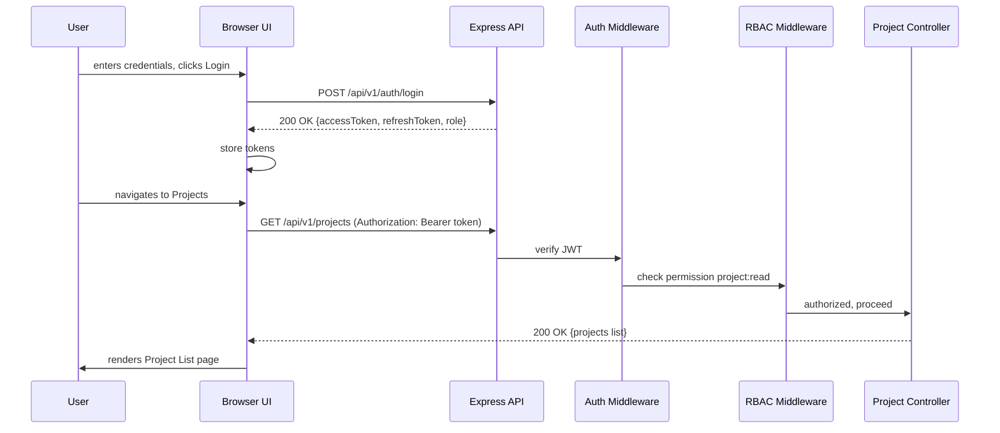

# 21. Sequence Diagrams

## 21.1 End-to-End: Manual Test Case Execution with Defect Logging

## 21.2 End-to-End: Automated Run Trigger to Dashboard Update

## 21.3 End-to-End: Login and Access to Protected Resource

