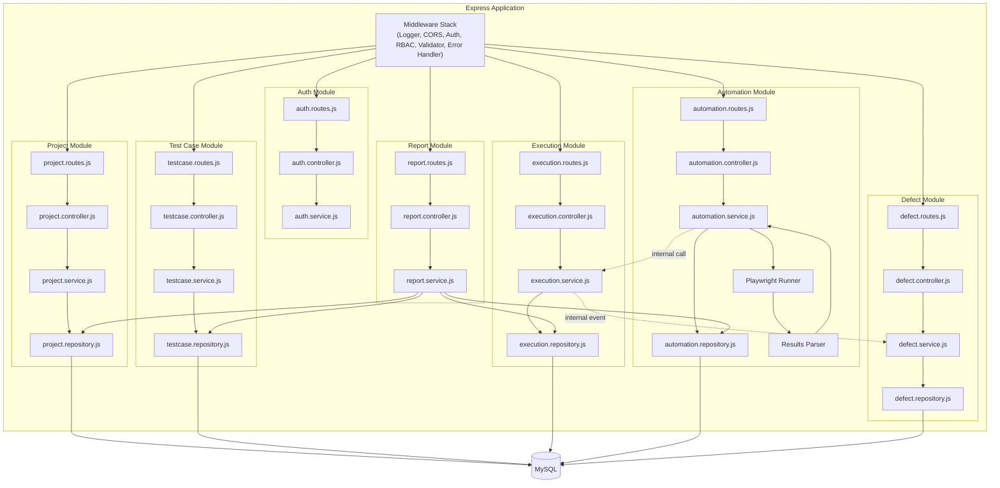
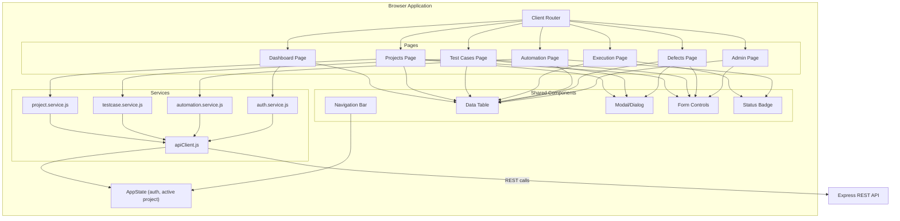

# 22. Component Diagram

## 22.1 Backend Component Diagram

## 22.2 Frontend Component Diagram

## 22.3 Notes
- Every module in the backend component diagram follows the identical internal shape
  (Route → Controller → Service → Repository), reinforcing the layered architecture defined in
  Section 5.
- Dotted lines represent internal, in-process service-to-service calls/events (Section 10), distinct
  from solid lines representing direct layer-to-layer calls.
