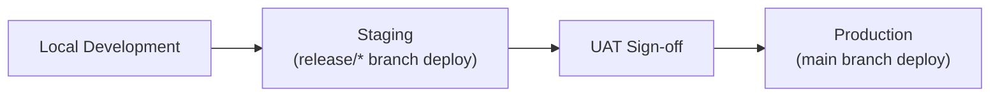

# 27. Environment Management

## 27.1 Overview
This document defines how VigCraft Testing Hub manages distinct runtime environments, building on
the environment-based configuration approach introduced in Section 16.4.1 and the variable list in
Section 17.

## 27.2 Environments
| Environment | Purpose | Config File |
|---|---|---|
| Local (Development) | Individual developer machines | `.env.development` |
| Staging/QA | Sprint demos, QA and automation validation, mirrors production | `.env.staging` |
| Production | Live system, post-UAT sign-off | `.env.production` |

## 27.3 Configuration Principles
- Every environment-specific value (DB credentials, `JWT_SECRET`, API base URL, log level, feature
  flags) is supplied via environment variables — never hard-coded in source.
- All environment files share the same variable **shape**, defined once in `.env.example`; only
  values differ between environments.
- The application never infers behavior from `NODE_ENV` string comparisons scattered through the
  codebase; a single config module (`backend/config/`) reads `NODE_ENV` once and exposes typed
  config to the rest of the app.

## 27.4 Promotion Flow

- Code is promoted between environments unchanged; only configuration changes.
- This mirrors the branching/release process in Section 20.1 and the rollback strategy in Section
  16.7.

## 27.5 Secrets Handling (MVP)
- Secrets live only in each environment's `.env` file, which is never committed to version control
  (`.gitignore` excludes all `.env*` except `.env.example`).
- Production secrets are provisioned directly on the hosting environment, not passed through CI logs
  or shared documents.
- A centralized secrets manager is explicitly a Future Scope item (Section 23.3) once compliance
  requirements exceed what file-based `.env` management can reasonably support.

## 27.6 Environment Parity
- Staging is kept as close to Production as practical (same MySQL major version, same Node.js
  version — Section 25.2) specifically so issues surface in Staging/UAT rather than after release.
- Local development is permitted to diverge in convenience-only ways (e.g., verbose `debug` logging,
  relaxed CORS) that never affect business logic behavior.
