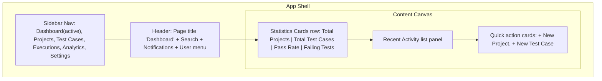

# Wireframe — Dashboard

## Purpose
Give an authenticated user an at-a-glance summary of testing health across their projects the moment they log in: key metrics, recent activity, and fast paths into deeper modules.

## Layout



## Components Used
- Sidebar (see `components.md` → Sidebar Design)
- Header (global search, notifications, user menu)
- Dashboard Cards ×4 (statistics: label + headline metric + trend delta)
- Card (Recent Activity — list of timestamped events, each row using a ledger-bar status accent where the event is result-related)
- Card (Quick Links — icon + label, routes to Create Project / Create Test Case)
- Empty state (Recent Activity panel, if account is new with no activity yet)
- Skeleton loaders (statistics cards + activity list while data loads)

## User Flow

```mermaid
flowchart TD
    A[User logs in] --> B[Land on /dashboard]
    B --> C[View statistics cards]
    C --> D{Click a stat card?}
    D -- Yes, e.g. Failing Tests --> E[Navigate to filtered Test Cases list]
    D -- No --> F[Scroll to Recent Activity]
    F --> G{Click an activity item?}
    G -- Yes --> H[Navigate to the related Project/Test Case]
    F --> I[Click + New Project] --> J[/projects/create]
    F --> K[Click + New Test Case] --> L[/test-cases/create]
```

## Navigation
- Sidebar item "Dashboard" is active/highlighted with the teal ledger bar.
- Statistics cards are clickable and deep-link into filtered views of Projects/Test Cases/Executions.
- Recent Activity items link to their source entity.
- Global search (header) queries across projects and test cases.

## Validation Rules
- Not a form-heavy page — no field validation. Relevant rules:
  - Statistics cards must degrade gracefully to "—" (em dash) rather than 0 or blank when data is loading vs. genuinely zero, to avoid ambiguity (skeleton state communicates "loading"; "0" only shown once data has resolved).
  - Recent Activity empty state requires at least one CTA (Create Project) to avoid a dead-end screen for new accounts.

## Mobile Layout (≤ 640px)
- Sidebar hidden by default (hamburger-triggered drawer).
- Statistics cards stack single-column, full width.
- Recent Activity and Quick Links stack below, full width, in the same vertical order as desktop.

## Tablet Layout (641–1024px)
- Sidebar collapsed to icon rail.
- Statistics cards reflow to 2-per-row grid.
- Recent Activity and Quick Links remain full-width single column below the stats grid.

## Desktop Layout (≥ 1025px)
- Sidebar expanded and persistent.
- Statistics cards in a 4-per-row auto-fill grid.
- Recent Activity (left, ~65% width) and Quick Links (right, ~35% width) arranged side by side below the stats row.
