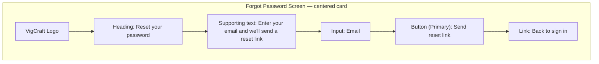

# Wireframe — Forgot Password

## Purpose
Let a user request a password-reset link via email without needing to be authenticated, then confirm the request was sent.

## Layout



## Components Used
- Card (centered, max-width 400px)
- Input (email)
- Button — Primary
- Alert (inline, confirmation state after successful submit — replaces the form)
- Inline link

## User Flow

```mermaid
flowchart TD
    A[User lands on /forgot-password] --> B[Enter email]
    B --> C[Click Send reset link]
    C --> D{Email format valid?}
    D -- No --> E[Inline field error] --> B
    D -- Yes --> F[Request sent to backend]
    F --> G[Card content replaced with confirmation Alert: Check your email]
    G --> H[User clicks Back to sign in] --> I[/login]
    A --> J[Click Back to sign in] --> I
```

## Navigation
- No sidebar/header chrome (pre-authentication).
- "Back to sign in" link returns to Login at any point.
- No redirect happens automatically — user must click through to Login after seeing the confirmation state.

## Validation Rules
- Email: required, valid email format.
- On submit, the UI shows the same confirmation message ("If an account exists for this email, a reset link has been sent") regardless of whether the email is registered — this prevents account enumeration and is a security requirement, not just a UX choice.
- Submit button disabled while the field is empty or invalid; shows a brief loading state while the request is in flight.

## Mobile Layout (≤ 640px)
- Full-width card, `--space-4` side margins, identical single-field structure.

## Tablet Layout (641–1024px)
- Centered card, max-width 400px, unchanged from desktop structure.

## Desktop Layout (≥ 1025px)
- Centered card, single column form — no multi-column variant needed for a one-field form.
