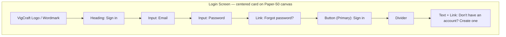

# Wireframe — Login

## Purpose
Authenticate an existing user and route them into the application. The single-responsibility entry point of the app — no navigation chrome (sidebar/header) is present here.

## Layout



## Components Used
- Card (elevated, centered, max-width 400px)
- Input (email, password with show/hide toggle)
- Button — Primary
- Inline link (text variant button)
- Alert (inline, appears above the form on failed login attempt)

## User Flow

```mermaid
flowchart TD
    A[User lands on /login] --> B{Has account?}
    B -- No --> C[Click 'Create one'] --> D[/register]
    B -- Yes --> E[Enter email + password]
    E --> F[Click Sign in]
    F --> G{Credentials valid?}
    G -- No --> H[Inline Alert: Invalid email or password] --> E
    G -- Yes --> I[Redirect to /dashboard]
    E --> J[Click Forgot password?] --> K[/forgot-password]
```

## Navigation
- No sidebar or header chrome on this page (pre-authentication).
- Footer-level links only: "Forgot password?" → Forgot Password page; "Create one" → Register page.
- On successful login: redirect to `/dashboard`.

## Validation Rules
- Email: required, must match a valid email format.
- Password: required, no client-side length disclosure beyond "required" (avoid hinting password policy to unauthenticated attackers).
- Submit button disabled until both fields are non-empty.
- Failed login shows a single generic inline Alert ("Invalid email or password") — never specifies which field was wrong.
- Rate-limit messaging after repeated failures: inline Alert warning of temporary lockout, per backend policy.

## Mobile Layout (≤ 640px)
- Card becomes full-width with `--space-4` side margins, vertically centered with top-weighted spacing (not perfectly centered, to stay above the mobile keyboard when it opens).
- Logo scales down; single-column form retained (already single column at all sizes).

## Tablet Layout (641–1024px)
- Card centered, fixed max-width 400px, generous surrounding canvas space. Identical structure to desktop, no reflow needed.

## Desktop Layout (≥ 1025px)
- Card centered in viewport, optional split-screen treatment (left: brand/illustration panel, right: form card) may be introduced post-Sprint-1; Sprint 1 ships the centered single-card version only.
