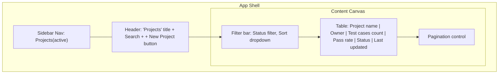
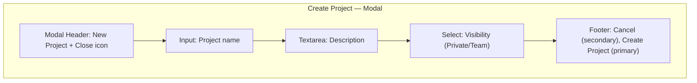
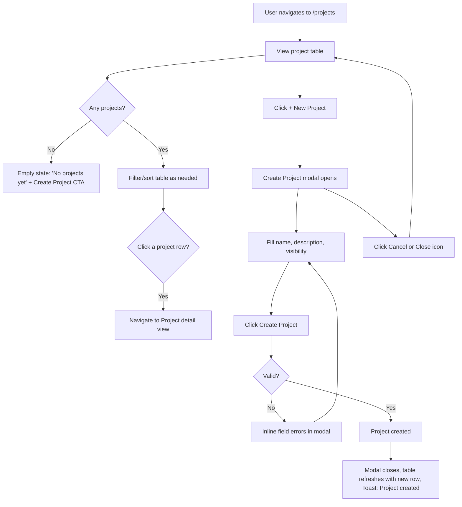

# Wireframe — Projects (List + Create)

## Purpose
Let users view all projects they have access to, understand each project's health status at a glance, and create new projects. Covers both the Project List and Create Project screens as one module.

## Layout — Project List

## Layout — Create Project (Modal)

## Components Used
- Sidebar, Header (global chrome)
- Table (with row-level status badge / ledger accent per project health)
- Filter bar (dropdown + sort control)
- Pagination
- Modal (Create Project form)
- Input, Textarea, Select
- Button — Primary ("+ New Project", "Create Project"), Secondary ("Cancel")
- Empty state (no projects yet)
- Skeleton loader (table rows while loading)

## User Flow

## Navigation
- Sidebar item "Projects" active with teal ledger bar.
- Table rows are clickable, routing to a project detail view (post-Sprint-1 scope for full detail; Sprint 1 table links reserved for this route).
- "+ New Project" button in the header opens the Create Project modal without a page navigation.

## Validation Rules
- Project name: required, 3–80 characters, must be unique within the user's workspace (server-checked on submit).
- Description: optional, max 500 characters, character counter shown near the limit.
- Visibility: required select, defaults to "Private."
- "Create Project" button disabled until the name field is valid; description/visibility have valid defaults so they don't block submission.
- Duplicate name error surfaces as an inline field error under the Name input, not a generic modal-level alert.

## Mobile Layout (≤ 640px)
- Table converts to stacked cards (per `responsive-guidelines.md`): each project renders as a card with label/value pairs and the status ledger bar on the left edge.
- "+ New Project" becomes an icon-only floating action button or a full-width button below the filter bar.
- Create Project modal expands to full-screen.

## Tablet Layout (641–1024px)
- Table retains real `<table>` layout but hides the "Last updated" column first if width is constrained; horizontal scroll as fallback.
- Create Project modal remains centered, standard modal width (560px).

## Desktop Layout (≥ 1025px)
- Full table with all columns visible, filters and pagination inline in the content header row.
- Create Project modal centered, 560px width, all fields visible without scrolling.
