# Wireframe — Register

## Purpose
Create a new user account, collecting the minimum information needed to provision access, then route the user into the app or an email-verification step.

## Layout

```mermaid
graph TD
    subgraph Screen["Register Screen — centered card"]
        Logo["VigCraft Logo"]
        Title["Heading: Create your account"]
        NameField["Input: Full name"]
        EmailField["Input: Work email"]
        PasswordField["Input: Password"]
        ConfirmField["Input: Confirm password"]
        TermsCheckbox["Checkbox: I agree to the Terms"]
        SubmitBtn["Button (Primary): Create account"]
        LoginPrompt["Text + Link: Already have an account? Sign in"]
    end
    Logo --> Title --> NameField --> EmailField --> PasswordField --> ConfirmField --> TermsCheckbox --> SubmitBtn --> LoginPrompt
```



## Components Used
- Card (centered, max-width 440px)
- Input × 4 (name, email, password, confirm password)
- Checkbox
- Button — Primary
- Inline Alert (validation summary / server error)
- Password-strength inline hint (helper text below password field)

## User Flow

```mermaid
flowchart TD
    A[User lands on /register] --> B[Fill name, email, password, confirm password]
    B --> C[Check 'I agree to Terms']
    C --> D[Click Create account]
    D --> E{All fields valid?}
    E -- No --> F[Inline field errors shown] --> B
    E -- Yes --> G{Email already registered?}
    G -- Yes --> H[Inline Alert: Email already in use] --> B
    G -- No --> I[Account created] --> J[Redirect to /dashboard or verification prompt]
    A --> K[Click Sign in] --> L[/login]
```

## Navigation
- No sidebar/header chrome (pre-authentication).
- "Sign in" link routes to Login page.
- On success: redirect to `/dashboard` (or an email-verification interstitial, per backend policy).

## Validation Rules
- Full name: required, minimum 2 characters.
- Work email: required, valid email format, checked for existing-account uniqueness on submit.
- Password: required, minimum 8 characters, at least one letter and one number (enforced client-side with inline helper text, re-validated server-side).
- Confirm password: must exactly match Password field.
- Terms checkbox: must be checked before submit is enabled.
- Submit button disabled until all client-side rules pass; server-side errors (e.g., duplicate email) surface as an inline Alert above the form without clearing already-entered fields.

## Mobile Layout (≤ 640px)
- Full-width card, `--space-4` side margins, single column (unchanged from base layout).
- Password requirement helper text remains visible (not tooltip-only) since hover states don't exist on touch.

## Tablet Layout (641–1024px)
- Centered card, max-width 440px, identical structure to desktop.

## Desktop Layout (≥ 1025px)
- Centered card; same single-column form (registration forms stay single-column at all breakpoints per `responsive-guidelines.md`).
