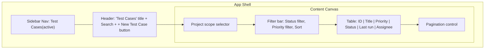
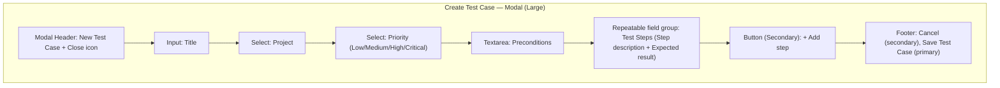
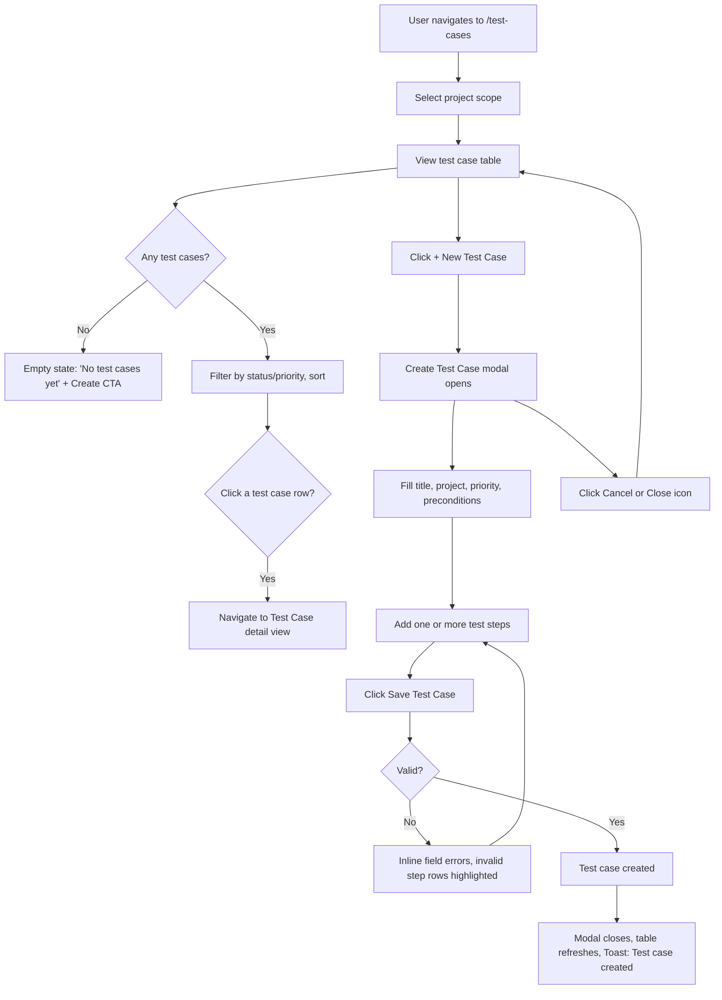

# Wireframe — Test Cases (List + Create)

## Purpose
Let users browse all test cases within a project (or across projects), see each case's latest execution status, and author new test cases. Covers both the Test Case List and Create Test Case screens.

## Layout — Test Case List

## Layout — Create Test Case

## Components Used
- Sidebar, Header (global chrome)
- Select (project scope)
- Filter bar (status, priority, sort)
- Table (with Status badge column using the ledger status system: Pass/Fail/Warn/Running/Not Run)
- Pagination
- Modal — large variant (720px) to accommodate the step-builder form
- Input, Textarea, Select
- Repeatable field group (dynamic add/remove step rows)
- Button — Primary ("+ New Test Case", "Save Test Case"), Secondary ("+ Add step," "Cancel")
- Empty state (no test cases yet, scoped per project)
- Skeleton loader (table rows while loading)

## User Flow

## Navigation
- Sidebar item "Test Cases" active with teal ledger bar.
- Project scope selector persists selection across the session (query param or frontend state), so returning to the page keeps context.
- Table rows route to a Test Case detail view (execution history, full step list) — reserved route for Sprint 1 linking, detail screen itself out of Sprint 1 scope.
- "+ New Test Case" opens the Create Test Case modal in place.

## Validation Rules
- Title: required, 5–120 characters.
- Project: required select — if the user arrived with a project already scoped, this is pre-filled and locked.
- Priority: required select, defaults to "Medium."
- Preconditions: optional, max 1000 characters.
- Test Steps: at least one step required; each step requires both a Step Description and an Expected Result before it counts as valid — incomplete steps are highlighted inline rather than silently dropped on submit.
- "+ Add step" has no upper limit in Sprint 1 but each new row scrolls into view automatically.
- "Save Test Case" button disabled until Title, Project, Priority, and at least one complete step are valid.

## Mobile Layout (≤ 640px)
- Table converts to stacked cards, each showing ID, Title, Status badge (ledger bar accent), Priority; secondary fields (Assignee, Last run) shown as labeled lines within the card.
- Create Test Case modal expands to full-screen; step rows stack vertically with clear visual separation (divider) between steps.

## Tablet Layout (641–1024px)
- Table retains columns but "Assignee" hides first under width pressure, restorable via horizontal scroll.
- Create Test Case modal centered at large-modal width (720px), step rows remain two-column (Step | Expected Result) if space allows, else stack.

## Desktop Layout (≥ 1025px)
- Full table, all columns visible.
- Create Test Case modal at full 720px width, step rows displayed as a clear two-column grid (Step Description | Expected Result) with a remove icon per row.
